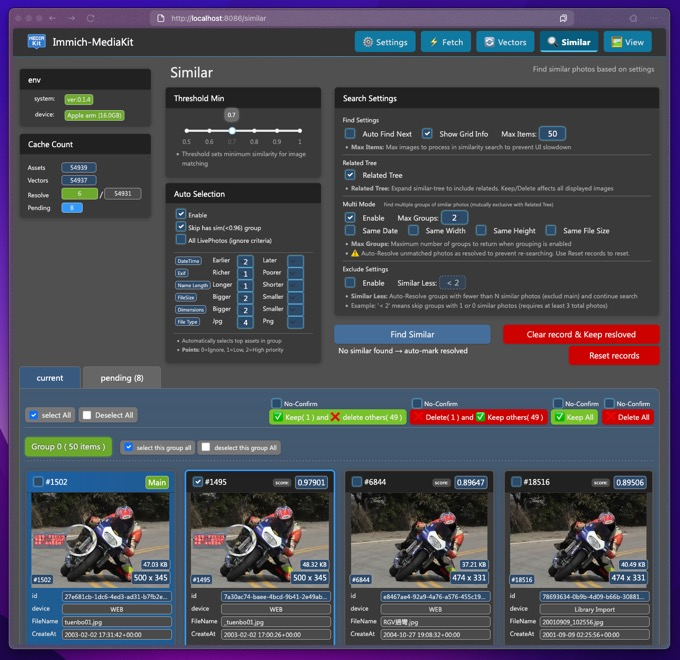

<p align="center"></p>

<p align="center"></p>
<p align="center">
<small> 
An extension toolkit for <a href="https://github.com/immich-app/immich">Immich</a>
enabling advanced management capabilities through AI-powered similarity detection
</small>
</p>
<p align="center">
<a href="https://buymeacoffee.com/razgrizhsu" target="_blank"></a>
</p>

## Features

- **Asset Management**: Import and manage photo assets from Immich
- **AI-Powered Vector**: Convert photos to feature vectors using ResNet152 for advanced similarity detection
- **Duplicate Detection**: Find and manage duplicate photos based on visual similarity
- **Filtering and Batch**: Browse photo library with filtering options and perform batch operations
- **Web-Based UI**: User-friendly dashboard for all operations


## preivew

<p align="center">

</p>

### processing
<p align="center">

</p>


## How It Works

1. Fetches Users & Assets data from the Immich PostgreSQL database
2. Processes images through ResNet152 to extract feature vectors
3. Stores vectors in the Qdrant vector database
4. Uses vector similarity to identify similar/duplicate photos
5. Displays similar photo groups based on the configured threshold
6. Manages asset deletion by updating Immich database directly:
   - Follows Immich's deletion logic for compatibility
   - **Important**: Enable trash feature in Immich settings first
   - Deleted assets appear in Immich's trash where you can permanently delete or restore them


## Usage Guide

### Basic Operations

- `Find Similar`
  - Starts searching for the next photo that matches your `Threshold Min` settings and shows it in the `current` tab
  - When photo groups appear in the `current` tab, you can click on a photo's header to select it. This lights up the four action buttons on the top right. After using one of these actions, the kept photos in that group will be marked as resolved
  - If you don't do anything with a searched group, it'll show up in the `pending` tab waiting for you to handle it later

- `Clear records & Keep resolved`
  - Clears out search records that haven't been resolved yet
  - This keeps all the records you've already marked as resolved

- `Reset records`
  - Resets all search records, including the ones you've marked as resolved


### Search Configuration

- Make the most of `Auto Selection`
  - When you enable auto selection, it'll automatically choose which photos to keep or delete after you run `Find Similar`. Just scroll through to review, then hit one of the four action buttons at the top

- `Multi Mode (Muod)` search feature
  - By default (when `Multi Mode` is off), it only searches for one group of photos at a time
  - Turn this on and set the `Max Group` number when you've got tons of photos to filter through - super handy for big cleanups
  - **Note: Multi Mode and Related Tree are mutually exclusive**

- Related Tree (rtree)
  - **Only available in single group mode (when Multi Mode is off)**
  - When `Related Tree` is off, `Find Similar` only shows photos directly related to the main photo
  - Turn it on and it'll also search for photos related to those related photos, creating a comprehensive similarity tree
  - **Cannot be used together with Multi Mode for performance and clarity reasons**
  - `MaxItems` limits how deep the search goes. Say you set the threshold to `(0.5, 1)` - that might trigger endless searching if you have 100k photos, so this cap keeps things under control
  - Note: The number of photos directly related to the main photo isn't limited by `MaxItems`

**Mode Selection**: Choose Single Mode + Related Tree for comprehensive similarity trees, or Multi Mode for quick processing of multiple separate groups.

### Advanced Strategies

- **Progressive cleaning approach**
  - Start with the highest similarity threshold and work your way down:
    - First, get rid of exact duplicates `(0.97-1.00)`
    - Then find near-duplicates `(0.90-0.97)`
    - Finally, catch similar but different shots `(0.80-0.90)`
  - This way you tackle the obvious duplicates first, then deal with the photos that need more careful judgment

- **Clear and rescan strategy**
  - Before changing your threshold settings, use `Reset Records` to wipe all similarity data
  - This lets you rescan all photos with new thresholds and avoid missing anything or getting false matches

- **Auto Selection optimization**
  - Configure selection criteria: FileSize +3 for higher quality, Name Longer +3 for descriptive filenames
  - Review auto-selected results before batch processing

- **Large collection tips**
  - For 8000+ photos: Enable Multi Mode with appropriate Max Group settings
  - Use batch operations for efficiency

- **External library considerations**
  - Ensure external library paths are not set to read-only if using Docker Compose
  - Enable Immich's recycle bin feature before processing external libraries
  - Remember that MediaKit reads from Immich thumbnails, so original file locations don't affect similarity detection

## Installation & Setup

### Prerequisites

- Access to an Immich installation with trash feature enabled
- A configured `.env` file (see above)


### Connecting to Immich Database

If your Immich is running with Docker Compose, you need to expose the PostgreSQL port. Add the following port mapping to your Immich's docker-compose.yml:

```yaml
services:
  database:
    container_name: immich_postgres
    image: ghcr.io/immich-app/postgres:14-vectorchord0.3.0-pgvectors0.2.0
    ports:
      - "5432:5432"  # Add this line to expose PostgreSQL
```

After updating, restart Immich to apply the changes. The exposed port (5432) should match the `PSQL_PORT` setting in your MediaKit `.env` file.


### Environment Variables

Create a `.env` file with the following variables:

```
# PostgreSQL connection to Immich
PSQL_HOST=localhost
PSQL_PORT=5432
PSQL_DB=immich
PSQL_USER=postgres
PSQL_PASS=postgres

# Immich connection
IMMICH_PATH=/path/to/immich/library

# Qdrant connection (not needed for Docker Compose)
QDRANT_URL=http://localhost:6333
QDRANT_PORT=6333

# MediaKit settings
MKIT_PORT=8086
MIKT_PORTWS=8087       # for background tasks (optional, default: 8087)
MKIT_WS_HOST=localhost  # for non-Docker setups (optional)
MKIT_DATA=/path/to/data/dir
```


### Option 1: Docker Compose (Recommended)

The easiest way to run Immich-MediaKit is with Docker Compose, which automatically includes the Qdrant vector database:

1. Ensure you have created the `.env` file
2. Run:

```bash
# Build and start containers
docker compose up -d --build
```

### Option 2: Direct Installation

If you prefer to run without Docker:

1. Install Qdrant server separately
2. Ensure you have created the `.env` file
3. Install Python dependencies:
   ```bash
   pip install -r requirements.txt
   ```
4. Run the application:
   ```bash
   python -m src.app
   ```


## Developer Notes

Initially, I was planning to build this with Electron + React frontend + Node.js backend, but given how much easier it is to integrate machine learning stuff with Python, I ended up going the Python route.

I usually use Gradio for quick AI demos, but it gets pretty limiting when you want more customization. Same story with Streamlit - they're great for prototypes but not so flexible for complex UIs. After trying a bunch of different options, I settled on Dash by Plotly. Sure, it still needs a lot of custom work to get exactly what I want, but it gets the job done pretty well.

What started as a simple little tool to help me clean up duplicate photos somehow turned into this whole complex system... funny how these things grow, right?

Hope this tool helps anyone who's dealing with the same photo organization headaches! :)

by raz


## Contributing

Contributions are welcome! Please feel free to submit a Pull Request.

If you find this project helpful, consider buying me a coffee:

[](https://buymeacoffee.com/razgrizhsu)

## License

This project is licensed under the [GNU General Public License v3.0 (GPLv3)](https://www.gnu.org/licenses/gpl-3.0.en.html).

Commercial use is permitted, but any derivative works must also be open-sourced under the same license. If you modify and distribute this software, you must make your source code publicly available.

## Disclaimer

This tool interacts with your Immich photo library and database.
While designed to be safe, it is still under active development and may contain unexpected behaviors.
Please consider the following:

- Always backup your Immich database before performing operations that modify data
- Use the similarity threshold carefully when identifying duplicates to avoid false positives
- The developers are not responsible for any data loss that may occur from using this tool
- Vector similarity is based on AI models and may not perfectly match human perception of similarity

Immich-MediaKit is provided "as is" without warranty of any kind. By using this software, you acknowledge the potential risks involved in managing and potentially modifying your photo collection.

Happy organizing! We hope this tool enhances your Immich experience by helping you maintain a clean, duplicate-free library.
